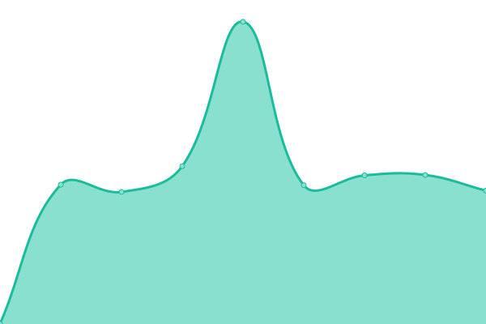
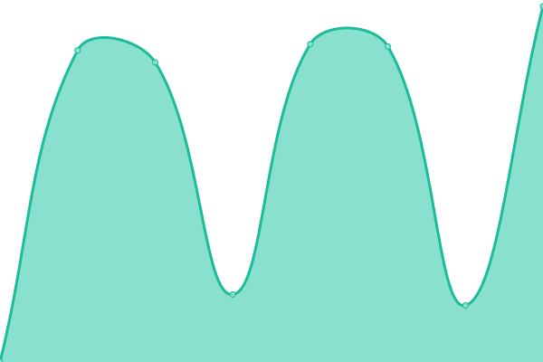
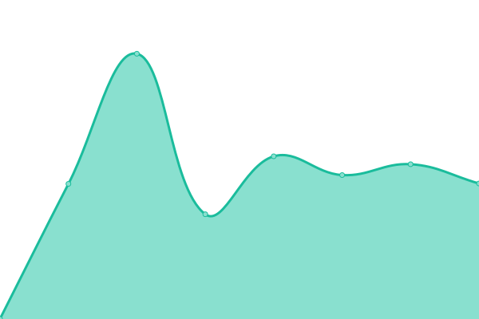
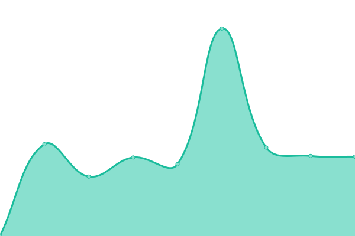
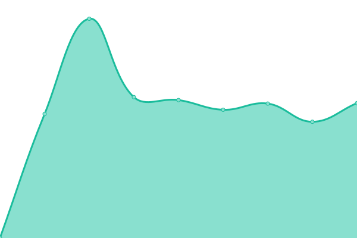
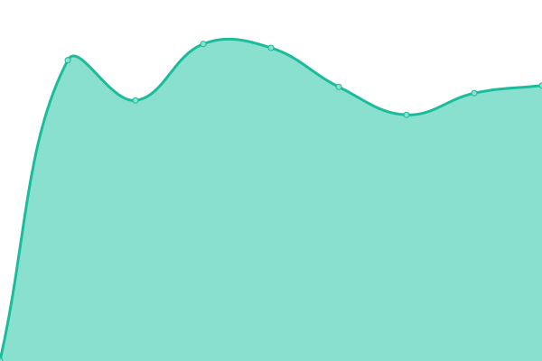
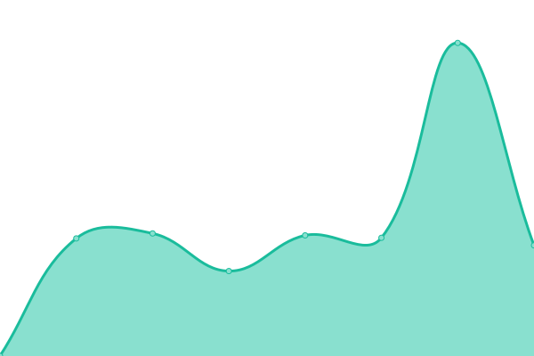

# [📈 Live Status](https://uptime.immersemarketing.com.au): <!--live status--> **🟩 All systems operational**

This repository contains the open-source uptime monitor and status page for [holty07](https://uptime.immersemarketing.com.au), powered by [Upptime](https://github.com/upptime/upptime).

With [Upptime](https://upptime.js.org), you can get your own unlimited and free uptime monitor and status page, powered entirely by a GitHub repository. We use [Issues](https://github.com/holty07/Immerse-Uptime-Monitor/issues) as incident reports, [Actions](https://github.com/holty07/Immerse-Uptime-Monitor/actions) as uptime monitors, and [Pages](https://uptime.immersemarketing.com.au) for the status page.

<!--start: status pages-->
<!-- This summary is generated by Upptime (https://github.com/upptime/upptime) -->
<!-- Do not edit this manually, your changes will be overwritten -->
<!-- prettier-ignore -->
| URL | Status | History | Response Time | Uptime |
| --- | ------ | ------- | ------------- | ------ |
|  [Immerse Marketing](https://immersemarketing.com.au) | 🟩 Up | [immerse-marketing.yml](https://github.com/holty07/Immerse-Uptime-Monitor/commits/HEAD/history/immerse-marketing.yml) | 

 1078ms
     
 | 

<a href="https://uptime.immersemarketing.com.au/history/immerse-marketing">100.00%</a>
    

|  [ALC Training (AU)](https://alctraining.com.au) | 🟩 Up | [alc-training-au.yml](https://github.com/holty07/Immerse-Uptime-Monitor/commits/HEAD/history/alc-training-au.yml) | 

 2707ms
     
 | 

<a href="https://uptime.immersemarketing.com.au/history/alc-training-au">99.56%</a>
    

|  [Billie Bob](https://billiebob.com.au) | 🟩 Up | [billie-bob.yml](https://github.com/holty07/Immerse-Uptime-Monitor/commits/HEAD/history/billie-bob.yml) | 

 1347ms
     
 | 

<a href="https://uptime.immersemarketing.com.au/history/billie-bob">100.00%</a>
    

|  [Briggins](https://www.briggins.com.au) | 🟩 Up | [briggins.yml](https://github.com/holty07/Immerse-Uptime-Monitor/commits/HEAD/history/briggins.yml) | 

 3537ms
     
 | 

<a href="https://uptime.immersemarketing.com.au/history/briggins">100.00%</a>
    

|  [Coral Covey](https://coralcovey.com) | 🟩 Up | [coral-covey.yml](https://github.com/holty07/Immerse-Uptime-Monitor/commits/HEAD/history/coral-covey.yml) | 

 1068ms
     
 | 

<a href="https://uptime.immersemarketing.com.au/history/coral-covey">100.00%</a>
    

|  [CWBTS](https://cwbts.com.au) | 🟩 Up | [cwbts.yml](https://github.com/holty07/Immerse-Uptime-Monitor/commits/HEAD/history/cwbts.yml) | 

 1254ms
     
 | 

<a href="https://uptime.immersemarketing.com.au/history/cwbts">100.00%</a>
    

|  [Disability and Injury Services](https://disabilityandinjuryservices.com.au) | 🟩 Up | [disability-and-injury-services.yml](https://github.com/holty07/Immerse-Uptime-Monitor/commits/HEAD/history/disability-and-injury-services.yml) | 

 1295ms
     
 | 

<a href="https://uptime.immersemarketing.com.au/history/disability-and-injury-services">99.75%</a>
    

|  [Farm Fresh Fundraising](https://farmfreshfundraising.com.au) | 🟩 Up | [farm-fresh-fundraising.yml](https://github.com/holty07/Immerse-Uptime-Monitor/commits/HEAD/history/farm-fresh-fundraising.yml) | 

 1290ms
     
 | 

<a href="https://uptime.immersemarketing.com.au/history/farm-fresh-fundraising">100.00%</a>
    

|  [Fiona Schofield Millinery](https://fionaschofieldmillinery.com.au) | 🟩 Up | [fiona-schofield-millinery.yml](https://github.com/holty07/Immerse-Uptime-Monitor/commits/HEAD/history/fiona-schofield-millinery.yml) | 

 1272ms
     
 | 

<a href="https://uptime.immersemarketing.com.au/history/fiona-schofield-millinery">100.00%</a>
    

|  [Holt Plumbing](https://holtplumbing.com.au) | 🟩 Up | [holt-plumbing.yml](https://github.com/holty07/Immerse-Uptime-Monitor/commits/HEAD/history/holt-plumbing.yml) | 

 1446ms
     
 | 

<a href="https://uptime.immersemarketing.com.au/history/holt-plumbing">100.00%</a>
    

|  [JSM Accounting](https://jsmaccounting.com.au) | 🟩 Up | [jsm-accounting.yml](https://github.com/holty07/Immerse-Uptime-Monitor/commits/HEAD/history/jsm-accounting.yml) | 

 1141ms
     
 | 

<a href="https://uptime.immersemarketing.com.au/history/jsm-accounting">100.00%</a>
    

|  [Longenergy](https://longenergy.com.au) | 🟩 Up | [longenergy.yml](https://github.com/holty07/Immerse-Uptime-Monitor/commits/HEAD/history/longenergy.yml) | 

 1251ms
     
 | 

<a href="https://uptime.immersemarketing.com.au/history/longenergy">100.00%</a>
    

|  [Need2Heal](https://need2heal.com.au) | 🟩 Up | [need2-heal.yml](https://github.com/holty07/Immerse-Uptime-Monitor/commits/HEAD/history/need2-heal.yml) | 

 1261ms
     
 | 

<a href="https://uptime.immersemarketing.com.au/history/need2-heal">100.00%</a>
    

|  [Ninox EMS](https://ninoxems.com) | 🟩 Up | [ninox-ems.yml](https://github.com/holty07/Immerse-Uptime-Monitor/commits/HEAD/history/ninox-ems.yml) | 

 1781ms
     
 | 

<a href="https://uptime.immersemarketing.com.au/history/ninox-ems">100.00%</a>
    

|  [Pets.com.au](https://pets.com.au) | 🟩 Up | [pets-com-au.yml](https://github.com/holty07/Immerse-Uptime-Monitor/commits/HEAD/history/pets-com-au.yml) | 

 1435ms
     
 | 

<a href="https://uptime.immersemarketing.com.au/history/pets-com-au">100.00%</a>
    

|  [Pipers World](https://pipersworld.com.au) | 🟩 Up | [pipers-world.yml](https://github.com/holty07/Immerse-Uptime-Monitor/commits/HEAD/history/pipers-world.yml) | 

 1287ms
     
 | 

<a href="https://uptime.immersemarketing.com.au/history/pipers-world">100.00%</a>
    

|  [Quiet Network](https://quietnetwork.com.au) | 🟩 Up | [quiet-network.yml](https://github.com/holty07/Immerse-Uptime-Monitor/commits/HEAD/history/quiet-network.yml) | 

 1114ms
     
 | 

<a href="https://uptime.immersemarketing.com.au/history/quiet-network">100.00%</a>
    

|  [Snacktacular](https://snacktacular.com.au) | 🟩 Up | [snacktacular.yml](https://github.com/holty07/Immerse-Uptime-Monitor/commits/HEAD/history/snacktacular.yml) | 

 1610ms
     
 | 

<a href="https://uptime.immersemarketing.com.au/history/snacktacular">100.00%</a>
    

|  [Sunny Coast Plumbing](https://sunnycoastplumbing.com.au) | 🟩 Up | [sunny-coast-plumbing.yml](https://github.com/holty07/Immerse-Uptime-Monitor/commits/HEAD/history/sunny-coast-plumbing.yml) | 

 2257ms
     
 | 

<a href="https://uptime.immersemarketing.com.au/history/sunny-coast-plumbing">100.00%</a>
    

<!--end: status pages-->

[**Visit our status website →**](https://uptime.immersemarketing.com.au)

## 📄 License

- Powered by: [Upptime](https://github.com/upptime/upptime)
- Code: [MIT](./LICENSE) © [Anand Chowdhary](https://anandchowdhary.com), supported by [Pabio](https://pabio.com)
- Data in the `./history` directory: [Open Database License](https://opendatacommons.org/licenses/odbl/1-0/)
